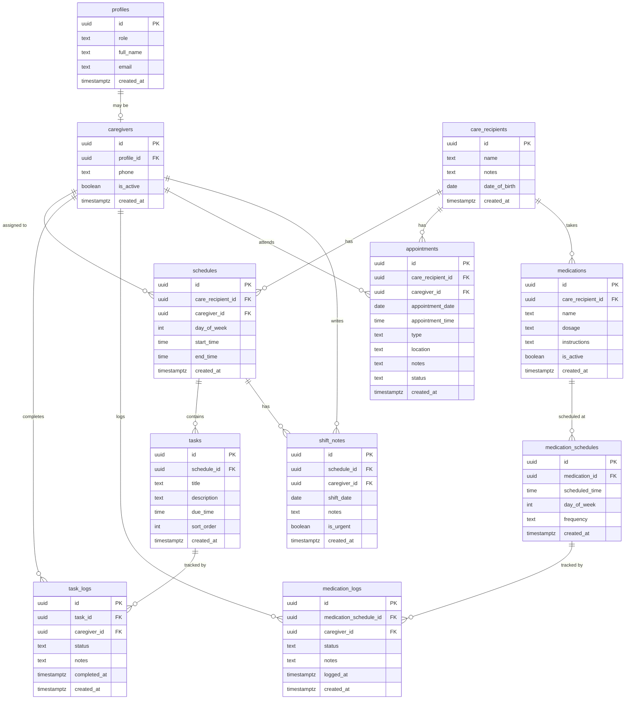

# 📊 Database Schema - Care Coordination App

## Entity Relationship Diagram



---

## 📋 Table Details

### 1. `profiles` - User Accounts

Extends Supabase `auth.users`. Every authenticated user gets a profile.

| Column | Type | Description |
|--------|------|-------------|
| `id` | uuid | **PK** - Links to `auth.users.id` |
| `role` | text | `'admin'` or `'caregiver'` |
| `full_name` | text | Display name |
| `email` | text | Email address |
| `created_at` | timestamptz | When created |

**Notes:**
- Created automatically via database trigger when user signs up
- Role determines access level throughout the app

---

### 2. `care_recipients` - People Being Cared For

| Column | Type | Description |
|--------|------|-------------|
| `id` | uuid | **PK** |
| `name` | text | Full name |
| `notes` | text | General notes, preferences, conditions |
| `date_of_birth` | date | Birth date |
| `created_at` | timestamptz | When created |

**Notes:**
- You can have multiple care recipients
- All schedules, appointments, and medications link to a care recipient

---

### 3. `caregivers` - Extended Caregiver Info

| Column | Type | Description |
|--------|------|-------------|
| `id` | uuid | **PK** |
| `profile_id` | uuid | **FK** → `profiles.id` (unique) |
| `phone` | text | Contact phone number |
| `is_active` | boolean | Whether currently active |
| `created_at` | timestamptz | When created |

**Notes:**
- Separate from `profiles` because not all users are caregivers (admin might not be)
- `is_active` allows soft-disabling a caregiver without deleting

---

### 4. `schedules` - Weekly Recurring Shifts

| Column | Type | Description |
|--------|------|-------------|
| `id` | uuid | **PK** |
| `care_recipient_id` | uuid | **FK** → `care_recipients.id` |
| `caregiver_id` | uuid | **FK** → `caregivers.id` |
| `day_of_week` | int | 0=Sunday, 1=Monday, ..., 6=Saturday |
| `start_time` | time | Shift start time |
| `end_time` | time | Shift end time |
| `created_at` | timestamptz | When created |

**Example:**
- Maria works Monday 8:00-16:00 caring for Grandma
- Juan works Monday 16:00-00:00 caring for Grandma

---

### 5. `tasks` - Things To Do During a Shift

| Column | Type | Description |
|--------|------|-------------|
| `id` | uuid | **PK** |
| `schedule_id` | uuid | **FK** → `schedules.id` |
| `title` | text | Task name (e.g., "Give breakfast") |
| `description` | text | Detailed instructions |
| `due_time` | time | **Optional** - Specific time for task (e.g., 8:00 AM) |
| `sort_order` | int | Display order (used when due_time is null) |
| `created_at` | timestamptz | When created |

**Notes:**
- Tasks are templates attached to schedules
- Same tasks repeat every week for that schedule
- `due_time` is optional - if set, task shows at that time; if null, uses `sort_order`

---

### 6. `task_logs` - Task Completion Records

| Column | Type | Description |
|--------|------|-------------|
| `id` | uuid | **PK** |
| `task_id` | uuid | **FK** → `tasks.id` |
| `caregiver_id` | uuid | **FK** → `caregivers.id` |
| `status` | text | `'completed'`, `'skipped'`, `'unable'` |
| `notes` | text | Optional notes |
| `completed_at` | timestamptz | When the action was taken |
| `created_at` | timestamptz | When logged |

**Notes:**
- One log per task per day
- Tracks accountability and history

---

### 7. `shift_notes` - Handoff Notes Between Shifts

| Column | Type | Description |
|--------|------|-------------|
| `id` | uuid | **PK** |
| `schedule_id` | uuid | **FK** → `schedules.id` |
| `caregiver_id` | uuid | **FK** → `caregivers.id` |
| `shift_date` | date | Date of the shift |
| `notes` | text | Handoff notes for next caregiver |
| `is_urgent` | boolean | Flag for urgent information |
| `created_at` | timestamptz | When created |

**Notes:**
- Caregivers leave notes at end of shift for the next caregiver
- `is_urgent` highlights critical information (e.g., "Patient fell today")
- Next caregiver sees these notes when starting their shift

---

### 8. `appointments` - One-Time Events

| Column | Type | Description |
|--------|------|-------------|
| `id` | uuid | **PK** |
| `care_recipient_id` | uuid | **FK** → `care_recipients.id` |
| `caregiver_id` | uuid | **FK** → `caregivers.id` (nullable) |
| `appointment_date` | date | Date of appointment |
| `appointment_time` | time | Time of appointment |
| `type` | text | e.g., "doctor", "therapy", "lab" |
| `location` | text | Address or place name |
| `notes` | text | Additional info |
| `status` | text | `'scheduled'`, `'completed'`, `'cancelled'` |
| `created_at` | timestamptz | When created |

**Notes:**
- `caregiver_id` is nullable (can be assigned later)
- Used for doctor visits, therapy sessions, etc.

---

### 8. `medications` - Medication Definitions

| Column | Type | Description |
|--------|------|-------------|
| `id` | uuid | **PK** |
| `care_recipient_id` | uuid | **FK** → `care_recipients.id` |
| `name` | text | Medication name |
| `dosage` | text | e.g., "500mg", "2 tablets" |
| `instructions` | text | How to administer |
| `is_active` | boolean | Currently prescribed |
| `created_at` | timestamptz | When created |

**Notes:**
- `is_active` allows keeping history of past medications

---

### 9. `medication_schedules` - When To Give Medications

| Column | Type | Description |
|--------|------|-------------|
| `id` | uuid | **PK** |
| `medication_id` | uuid | **FK** → `medications.id` |
| `scheduled_time` | time | Time to administer |
| `day_of_week` | int | **Nullable** - 0=Sunday...6=Saturday (for weekly meds) |
| `frequency` | text | `'daily'`, `'weekly'`, etc. |
| `created_at` | timestamptz | When created |

**Example:**
- Aspirin: 8:00 AM daily (day_of_week = null), 8:00 PM daily (2 rows)
- Vitamin D: 8:00 AM weekly on Monday (day_of_week = 1)

---

### 10. `medication_logs` - Medication Administration Records

| Column | Type | Description |
|--------|------|-------------|
| `id` | uuid | **PK** |
| `medication_schedule_id` | uuid | **FK** → `medication_schedules.id` |
| `caregiver_id` | uuid | **FK** → `caregivers.id` |
| `status` | text | `'given'`, `'skipped'`, `'refused'` |
| `notes` | text | Optional notes |
| `logged_at` | timestamptz | When administered |
| `created_at` | timestamptz | When logged |

**Notes:**
- Critical for medication tracking and accountability
- `refused` status for when care recipient refuses medication

---

## 🔐 Row Level Security (RLS) Summary

| Table | Admin Access | Caregiver Access |
|-------|--------------|------------------|
| `profiles` | ALL | Own profile only |
| `care_recipients` | ALL | Via assigned schedules |
| `caregivers` | ALL | Own record only |
| `schedules` | ALL | Own schedules only |
| `tasks` | ALL | Tasks in own schedules |
| `task_logs` | ALL | Own logs only |
| `shift_notes` | ALL | Notes for schedules they work |
| `appointments` | ALL | Own appointments only |
| `medications` | ALL | Via care recipients they serve |
| `medication_schedules` | ALL | Via medications they can see |
| `medication_logs` | ALL | Own logs only |

---

## 🔄 Data Flow Examples

### Example 1: Caregiver Views Today's Tasks

```
1. Get current user's caregiver_id from profiles → caregivers
2. Get today's schedules where caregiver_id matches and day_of_week = today
3. Get tasks for those schedules, ordered by due_time then sort_order
4. Get task_logs for today to show completion status
5. Get shift_notes from previous shift for handoff info
```

### Example 2: Admin Creates a New Schedule

```
1. Select care_recipient
2. Select caregiver
3. Set day_of_week, start_time, end_time
4. Add tasks to the schedule with optional due_times
```

### Example 3: Caregiver Logs Medication

```
1. Get medications for care recipients in today's schedules
2. Get medication_schedules for current time window (check day_of_week for weekly meds)
3. Create medication_log with status and notes
```

### Example 4: Caregiver Leaves Handoff Notes

```
1. At end of shift, caregiver writes notes
2. Create shift_note with schedule_id, shift_date, notes
3. Mark is_urgent if critical info
4. Next caregiver sees this when starting their shift
```

---

## ✅ Schema Complete

The schema now includes:
- ✅ **Task timing** - `due_time` field in tasks table
- ✅ **Weekly medication day** - `day_of_week` field in medication_schedules
- ✅ **Handoff notes** - New `shift_notes` table

**Total: 11 tables**

Ready to implement!
