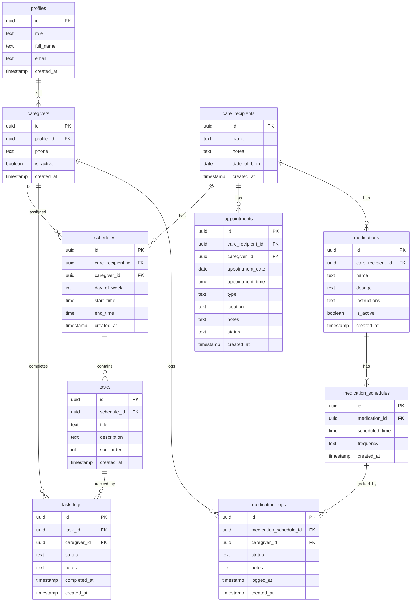

# 🚀 Implementation Plan – Care Coordination App

## Overview

This plan outlines the step-by-step implementation of the care coordination MVP. The approach is **database-first**, followed by frontend development so progress is visible quickly.

**Supabase Project:** `my_care` (ID: `uqjqpgxrqttvzvpnbdde`, Region: `us-east-2`)

---

## 📊 Database Schema Design

### Entity Relationship Diagram



---

## 🗂️ Table Definitions

### 1. `profiles` (extends Supabase auth.users)

| Column | Type | Constraints | Description |
|--------|------|-------------|-------------|
| id | uuid | PK, FK to auth.users | User ID from Supabase Auth |
| role | text | NOT NULL, CHECK | 'admin' or 'caregiver' |
| full_name | text | NOT NULL | Display name |
| email | text | NOT NULL | Email address |
| created_at | timestamptz | DEFAULT now() | Creation timestamp |

### 2. `care_recipients`

| Column | Type | Constraints | Description |
|--------|------|-------------|-------------|
| id | uuid | PK, DEFAULT gen_random_uuid() | Unique identifier |
| name | text | NOT NULL | Care recipient name |
| notes | text | | General notes |
| date_of_birth | date | | Birth date |
| created_at | timestamptz | DEFAULT now() | Creation timestamp |

### 3. `caregivers`

| Column | Type | Constraints | Description |
|--------|------|-------------|-------------|
| id | uuid | PK, DEFAULT gen_random_uuid() | Unique identifier |
| profile_id | uuid | FK to profiles, UNIQUE | Link to user profile |
| phone | text | | Contact phone |
| is_active | boolean | DEFAULT true | Active status |
| created_at | timestamptz | DEFAULT now() | Creation timestamp |

### 4. `schedules`

| Column | Type | Constraints | Description |
|--------|------|-------------|-------------|
| id | uuid | PK, DEFAULT gen_random_uuid() | Unique identifier |
| care_recipient_id | uuid | FK to care_recipients, NOT NULL | Which care recipient |
| caregiver_id | uuid | FK to caregivers, NOT NULL | Assigned caregiver |
| day_of_week | int | NOT NULL, CHECK 0-6 | 0=Sunday, 6=Saturday |
| start_time | time | NOT NULL | Shift start |
| end_time | time | NOT NULL | Shift end |
| created_at | timestamptz | DEFAULT now() | Creation timestamp |

### 5. `tasks`

| Column | Type | Constraints | Description |
|--------|------|-------------|-------------|
| id | uuid | PK, DEFAULT gen_random_uuid() | Unique identifier |
| schedule_id | uuid | FK to schedules, NOT NULL | Parent schedule |
| title | text | NOT NULL | Task title |
| description | text | | Task details |
| sort_order | int | DEFAULT 0 | Display order |
| created_at | timestamptz | DEFAULT now() | Creation timestamp |

### 6. `task_logs`

| Column | Type | Constraints | Description |
|--------|------|-------------|-------------|
| id | uuid | PK, DEFAULT gen_random_uuid() | Unique identifier |
| task_id | uuid | FK to tasks, NOT NULL | Which task |
| caregiver_id | uuid | FK to caregivers, NOT NULL | Who completed |
| status | text | NOT NULL, CHECK | 'completed', 'skipped', 'unable' |
| notes | text | | Optional notes |
| completed_at | timestamptz | DEFAULT now() | When completed |
| created_at | timestamptz | DEFAULT now() | Creation timestamp |

### 7. `appointments`

| Column | Type | Constraints | Description |
|--------|------|-------------|-------------|
| id | uuid | PK, DEFAULT gen_random_uuid() | Unique identifier |
| care_recipient_id | uuid | FK to care_recipients, NOT NULL | Which care recipient |
| caregiver_id | uuid | FK to caregivers | Assigned caregiver |
| appointment_date | date | NOT NULL | Date of appointment |
| appointment_time | time | NOT NULL | Time of appointment |
| type | text | NOT NULL | e.g., 'doctor', 'therapy' |
| location | text | | Address or place |
| notes | text | | Additional info |
| status | text | DEFAULT 'scheduled' | 'scheduled', 'completed', 'cancelled' |
| created_at | timestamptz | DEFAULT now() | Creation timestamp |

### 8. `medications`

| Column | Type | Constraints | Description |
|--------|------|-------------|-------------|
| id | uuid | PK, DEFAULT gen_random_uuid() | Unique identifier |
| care_recipient_id | uuid | FK to care_recipients, NOT NULL | Which care recipient |
| name | text | NOT NULL | Medication name |
| dosage | text | NOT NULL | e.g., '500mg' |
| instructions | text | | How to administer |
| is_active | boolean | DEFAULT true | Currently prescribed |
| created_at | timestamptz | DEFAULT now() | Creation timestamp |

### 9. `medication_schedules`

| Column | Type | Constraints | Description |
|--------|------|-------------|-------------|
| id | uuid | PK, DEFAULT gen_random_uuid() | Unique identifier |
| medication_id | uuid | FK to medications, NOT NULL | Which medication |
| scheduled_time | time | NOT NULL | Time to administer |
| frequency | text | DEFAULT 'daily' | 'daily', 'weekly', etc. |
| created_at | timestamptz | DEFAULT now() | Creation timestamp |

### 10. `medication_logs`

| Column | Type | Constraints | Description |
|--------|------|-------------|-------------|
| id | uuid | PK, DEFAULT gen_random_uuid() | Unique identifier |
| medication_schedule_id | uuid | FK to medication_schedules, NOT NULL | Which schedule |
| caregiver_id | uuid | FK to caregivers, NOT NULL | Who administered |
| status | text | NOT NULL, CHECK | 'given', 'skipped', 'refused' |
| notes | text | | Optional notes |
| logged_at | timestamptz | DEFAULT now() | When logged |
| created_at | timestamptz | DEFAULT now() | Creation timestamp |

---

## 🔐 Row Level Security (RLS) Strategy

### Principles

1. **Admin** (role = 'admin'): Full access to all tables
2. **Caregiver** (role = 'caregiver'): Access only to:
   - Their own profile
   - Schedules assigned to them
   - Tasks within their schedules
   - Appointments assigned to them
   - Medications for care recipients they serve
   - Their own logs

### Policy Summary

| Table | Admin | Caregiver |
|-------|-------|-----------|
| profiles | ALL | SELECT/UPDATE own |
| care_recipients | ALL | SELECT (via schedules) |
| caregivers | ALL | SELECT/UPDATE own |
| schedules | ALL | SELECT own |
| tasks | ALL | SELECT (via schedules) |
| task_logs | ALL | SELECT/INSERT own |
| appointments | ALL | SELECT own |
| medications | ALL | SELECT (via care_recipients) |
| medication_schedules | ALL | SELECT (via medications) |
| medication_logs | ALL | SELECT/INSERT own |

---

## 📁 Project Structure

```
/my_care
├── apps/
│   └── web/
│       ├── app/
│       │   ├── (auth)/
│       │   │   ├── login/
│       │   │   │   └── page.tsx
│       │   │   └── layout.tsx
│       │   ├── (dashboard)/
│       │   │   ├── admin/
│       │   │   │   ├── care-recipients/
│       │   │   │   ├── caregivers/
│       │   │   │   ├── schedules/
│       │   │   │   ├── tasks/
│       │   │   │   ├── appointments/
│       │   │   │   ├── medications/
│       │   │   │   └── page.tsx
│       │   │   ├── caregiver/
│       │   │   │   ├── today/
│       │   │   │   ├── tasks/
│       │   │   │   ├── medications/
│       │   │   │   └── page.tsx
│       │   │   └── layout.tsx
│       │   ├── layout.tsx
│       │   └── page.tsx
│       ├── components/
│       │   ├── ui/              # shadcn/ui components
│       │   ├── forms/           # Form components
│       │   ├── layout/          # Navigation, sidebar
│       │   └── shared/          # Shared components
│       ├── lib/
│       │   ├── supabase/
│       │   │   ├── client.ts    # Browser client
│       │   │   ├── server.ts    # Server client
│       │   │   └── middleware.ts
│       │   ├── actions/         # Server actions
│       │   └── utils.ts
│       ├── types/
│       │   └── database.ts      # Generated types
│       └── styles/
│           └── globals.css
├── supabase/
│   └── migrations/
├── plans/
├── AGENT.md
├── architecture.md
└── README.md
```

---

## 🚦 Implementation Phases

### Phase 1: Database Schema
1. Create `profiles` table with trigger for auth.users
2. Create `care_recipients` table
3. Create `caregivers` table
4. Create `schedules` table
5. Create `tasks` table
6. Create `task_logs` table
7. Create `appointments` table
8. Create `medications` table
9. Create `medication_schedules` table
10. Create `medication_logs` table
11. Set up all RLS policies
12. Create helper functions for role checking

### Phase 2: Next.js Project Setup
1. Initialize Next.js with App Router and TypeScript
2. Install and configure TailwindCSS
3. Install and configure shadcn/ui
4. Set up Supabase client (browser + server)
5. Configure environment variables
6. Generate TypeScript types from database

### Phase 3: Authentication Flow
1. Create login page
2. Create signup page (for caregivers invited by admin)
3. Set up auth middleware
4. Create role-based route protection
5. Build auth context/hooks

### Phase 4: Admin Interface
1. Admin dashboard (overview)
2. Care recipient CRUD
3. Caregiver CRUD (invite flow)
4. Schedule management
5. Task management (linked to schedules)
6. Appointment management
7. Medication management

### Phase 5: Caregiver Interface
1. Today's schedule view
2. Task list with completion
3. Medication list with logging
4. Upcoming appointments view

### Phase 6: Notifications
1. Email service setup
2. Shift reminder notifications
3. Medication reminder notifications
4. Appointment reminder notifications

---

## ✅ Ready to Start

The plan is ready. We will begin with **Phase 1: Database Schema** by creating migrations in Supabase.

Would you like to proceed?
