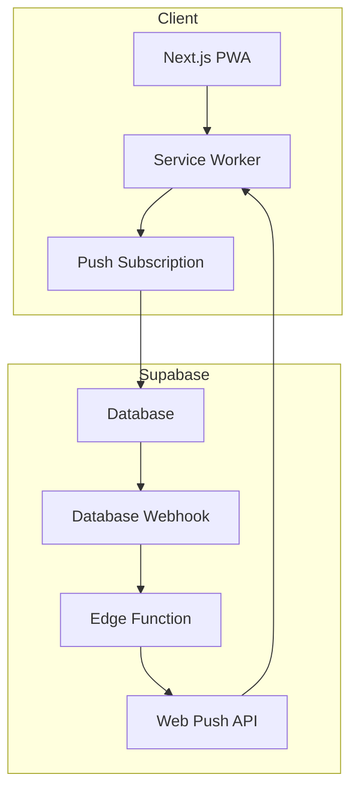

# 📱 Phase 6: PWA & Mobile Notifications

## Overview

This phase transforms the Care Coordination App into a Progressive Web App (PWA) with push notification support for mobile devices. The goal is to ensure caregivers receive timely reminders for medications, appointments, and shift changes.

**Key Focus Areas:**
1. PWA Configuration (installable app)
2. Push Notifications (medication, appointment, shift reminders)
3. Mobile UX Improvements (easy to read and use on mobile)

---

## Current State Analysis

### ✅ What's Already Done (Phases 1-5)
- Database schema complete with all tables and RLS policies
- Next.js App Router with TypeScript
- TailwindCSS + shadcn/ui components
- Authentication flow (login/signup)
- Admin interface (CRUD for all entities)
- Caregiver interface (tasks, medications, schedules)

### ❌ What's Missing for PWA
- No `manifest.json` file
- No service worker
- No PWA metadata in layout
- No push notification infrastructure
- No notification subscription storage in database

---

## Architecture



---

## Implementation Plan

### Part 1: PWA Configuration

#### 1.1 Install next-pwa
```bash
cd apps/web && npm install @ducanh2912/next-pwa
```

#### 1.2 Create manifest.json
Location: `apps/web/public/manifest.json`

```json
{
  "name": "MyCare - Coordinación de Cuidado",
  "short_name": "MyCare",
  "description": "Plataforma de coordinación de cuidado para cuidadores",
  "icons": [
    {
      "src": "/icons/icon-192x192.png",
      "sizes": "192x192",
      "type": "image/png",
      "purpose": "any maskable"
    },
    {
      "src": "/icons/icon-384x384.png",
      "sizes": "384x384",
      "type": "image/png"
    },
    {
      "src": "/icons/icon-512x512.png",
      "sizes": "512x512",
      "type": "image/png"
    }
  ],
  "theme_color": "#3b82f6",
  "background_color": "#ffffff",
  "start_url": "/dashboard",
  "display": "standalone",
  "orientation": "portrait"
}
```

#### 1.3 Update next.config.ts
```typescript
import type { NextConfig } from "next";
import withPWA from "@ducanh2912/next-pwa";

const nextConfig: NextConfig = {
  // existing config
};

export default withPWA({
  dest: "public",
  disable: process.env.NODE_ENV === "development",
  register: true,
  skipWaiting: true,
})(nextConfig);
```

#### 1.4 Update layout.tsx with PWA metadata
```typescript
export const metadata: Metadata = {
  title: "MyCare - Coordinación de Cuidado",
  description: "Plataforma de coordinación de cuidado para cuidadores",
  manifest: "/manifest.json",
  appleWebApp: {
    capable: true,
    statusBarStyle: "default",
    title: "MyCare",
  },
  formatDetection: {
    telephone: false,
  },
};

export const viewport: Viewport = {
  themeColor: "#3b82f6",
  width: "device-width",
  initialScale: 1,
  maximumScale: 1,
};
```

#### 1.5 Create PWA icons
Generate icons in these sizes:
- 192x192 (required)
- 384x384 (recommended)
- 512x512 (required)
- Apple touch icon 180x180

---

### Part 2: Push Notification Infrastructure

#### 2.1 Database Schema Changes

```sql
-- Add push subscription storage to profiles
ALTER TABLE public.profiles
ADD COLUMN push_subscription jsonb;

-- Create notifications table for tracking sent notifications
CREATE TABLE public.notifications (
  id uuid PRIMARY KEY DEFAULT gen_random_uuid(),
  user_id uuid REFERENCES auth.users(id) NOT NULL,
  type text NOT NULL CHECK (type IN ('medication', 'appointment', 'shift')),
  title text NOT NULL,
  body text NOT NULL,
  data jsonb,
  sent_at timestamptz DEFAULT now(),
  read_at timestamptz,
  created_at timestamptz DEFAULT now()
);

-- Enable RLS
ALTER TABLE public.notifications ENABLE ROW LEVEL SECURITY;

-- RLS policies
CREATE POLICY "Users can view own notifications"
ON public.notifications FOR SELECT
TO authenticated
USING (user_id = auth.uid());

CREATE POLICY "System can insert notifications"
ON public.notifications FOR INSERT
TO service_role
WITH CHECK (true);
```

#### 2.2 Generate VAPID Keys
```bash
npx web-push generate-vapid-keys
```

Store in Supabase secrets:
- `VAPID_PUBLIC_KEY`
- `VAPID_PRIVATE_KEY`
- `VAPID_SUBJECT` (mailto:your-email@example.com)

#### 2.3 Create Edge Function for Push Notifications

Location: `supabase/functions/push-notification/index.ts`

```typescript
import { createClient } from 'npm:@supabase/supabase-js@2'
import webpush from 'npm:web-push'

interface NotificationPayload {
  user_id: string
  type: 'medication' | 'appointment' | 'shift'
  title: string
  body: string
  data?: Record<string, unknown>
}

const supabase = createClient(
  Deno.env.get('SUPABASE_URL')!,
  Deno.env.get('SUPABASE_SERVICE_ROLE_KEY')!
)

webpush.setVapidDetails(
  Deno.env.get('VAPID_SUBJECT')!,
  Deno.env.get('VAPID_PUBLIC_KEY')!,
  Deno.env.get('VAPID_PRIVATE_KEY')!
)

Deno.serve(async (req) => {
  const payload: NotificationPayload = await req.json()
  
  // Get user's push subscription
  const { data: profile } = await supabase
    .from('profiles')
    .select('push_subscription')
    .eq('id', payload.user_id)
    .single()
  
  if (!profile?.push_subscription) {
    return new Response(JSON.stringify({ error: 'No subscription' }), {
      status: 404,
      headers: { 'Content-Type': 'application/json' }
    })
  }
  
  // Send push notification
  try {
    await webpush.sendNotification(
      profile.push_subscription,
      JSON.stringify({
        title: payload.title,
        body: payload.body,
        data: payload.data,
        icon: '/icons/icon-192x192.png',
        badge: '/icons/badge-72x72.png'
      })
    )
    
    // Log notification
    await supabase.from('notifications').insert({
      user_id: payload.user_id,
      type: payload.type,
      title: payload.title,
      body: payload.body,
      data: payload.data
    })
    
    return new Response(JSON.stringify({ success: true }), {
      headers: { 'Content-Type': 'application/json' }
    })
  } catch (error) {
    return new Response(JSON.stringify({ error: error.message }), {
      status: 500,
      headers: { 'Content-Type': 'application/json' }
    })
  }
})
```

---

### Part 3: Client-Side Push Subscription

#### 3.1 Create Push Notification Hook

Location: `apps/web/src/hooks/use-push-notifications.ts`

```typescript
'use client'

import { useState, useEffect } from 'react'
import { createClient } from '@/lib/supabase/client'

export function usePushNotifications() {
  const [isSupported, setIsSupported] = useState(false)
  const [subscription, setSubscription] = useState<PushSubscription | null>(null)
  const [permission, setPermission] = useState<NotificationPermission>('default')
  
  useEffect(() => {
    setIsSupported('serviceWorker' in navigator && 'PushManager' in window)
    if ('Notification' in window) {
      setPermission(Notification.permission)
    }
  }, [])
  
  const subscribe = async () => {
    if (!isSupported) return null
    
    const permission = await Notification.requestPermission()
    setPermission(permission)
    
    if (permission !== 'granted') return null
    
    const registration = await navigator.serviceWorker.ready
    const sub = await registration.pushManager.subscribe({
      userVisibleOnly: true,
      applicationServerKey: process.env.NEXT_PUBLIC_VAPID_PUBLIC_KEY
    })
    
    // Save subscription to database
    const supabase = createClient()
    const { data: { user } } = await supabase.auth.getUser()
    
    if (user) {
      await supabase
        .from('profiles')
        .update({ push_subscription: sub.toJSON() })
        .eq('id', user.id)
    }
    
    setSubscription(sub)
    return sub
  }
  
  const unsubscribe = async () => {
    if (subscription) {
      await subscription.unsubscribe()
      
      const supabase = createClient()
      const { data: { user } } = await supabase.auth.getUser()
      
      if (user) {
        await supabase
          .from('profiles')
          .update({ push_subscription: null })
          .eq('id', user.id)
      }
      
      setSubscription(null)
    }
  }
  
  return {
    isSupported,
    subscription,
    permission,
    subscribe,
    unsubscribe
  }
}
```

#### 3.2 Create Notification Settings Component

Location: `apps/web/src/components/notification-settings.tsx`

```typescript
'use client'

import { Button } from '@/components/ui/button'
import { Card, CardContent, CardDescription, CardHeader, CardTitle } from '@/components/ui/card'
import { usePushNotifications } from '@/hooks/use-push-notifications'
import { t } from '@/lib/translations'

export function NotificationSettings() {
  const { isSupported, permission, subscribe, unsubscribe } = usePushNotifications()
  
  if (!isSupported) {
    return (
      <Card>
        <CardContent className="py-6">
          <p className="text-muted-foreground">
            Las notificaciones push no están soportadas en este navegador.
          </p>
        </CardContent>
      </Card>
    )
  }
  
  return (
    <Card>
      <CardHeader>
        <CardTitle>Notificaciones</CardTitle>
        <CardDescription>
          Recibe recordatorios de medicamentos, citas y turnos
        </CardDescription>
      </CardHeader>
      <CardContent>
        {permission === 'granted' ? (
          <div className="space-y-4">
            <p className="text-green-600 dark:text-green-400">
              ✓ Notificaciones activadas
            </p>
            <Button variant="outline" onClick={unsubscribe}>
              Desactivar notificaciones
            </Button>
          </div>
        ) : permission === 'denied' ? (
          <p className="text-red-600 dark:text-red-400">
            Las notificaciones están bloqueadas. Por favor, habilítalas en la configuración del navegador.
          </p>
        ) : (
          <Button onClick={subscribe}>
            Activar notificaciones
          </Button>
        )}
      </CardContent>
    </Card>
  )
}
```

---

### Part 4: Notification Triggers

#### 4.1 Medication Reminders

Create a scheduled Edge Function that runs every 15 minutes:

```typescript
// supabase/functions/medication-reminders/index.ts
import { createClient } from 'npm:@supabase/supabase-js@2'

const supabase = createClient(
  Deno.env.get('SUPABASE_URL')!,
  Deno.env.get('SUPABASE_SERVICE_ROLE_KEY')!
)

Deno.serve(async () => {
  const now = new Date()
  const currentTime = now.toTimeString().slice(0, 5) // HH:MM
  const dayOfWeek = now.getDay()
  
  // Get medications due in the next 15 minutes
  const { data: schedules } = await supabase
    .from('medication_schedules')
    .select(`
      *,
      medications (
        name,
        dosage,
        care_recipients (name)
      )
    `)
    .or(`frequency.eq.daily,and(frequency.eq.weekly,day_of_week.eq.${dayOfWeek})`)
    .gte('scheduled_time', currentTime)
    .lte('scheduled_time', addMinutes(currentTime, 15))
  
  // Get caregivers on duty
  const { data: onDutyCaregivers } = await supabase
    .from('schedules')
    .select('caregiver_id, caregivers(profile_id)')
    .eq('day_of_week', dayOfWeek)
    .lte('start_time', currentTime)
    .gte('end_time', currentTime)
  
  // Send notifications
  for (const schedule of schedules || []) {
    for (const caregiver of onDutyCaregivers || []) {
      await fetch(`${Deno.env.get('SUPABASE_URL')}/functions/v1/push-notification`, {
        method: 'POST',
        headers: {
          'Content-Type': 'application/json',
          'Authorization': `Bearer ${Deno.env.get('SUPABASE_SERVICE_ROLE_KEY')}`
        },
        body: JSON.stringify({
          user_id: caregiver.caregivers.profile_id,
          type: 'medication',
          title: '💊 Recordatorio de Medicamento',
          body: `${schedule.medications.name} - ${schedule.medications.dosage} para ${schedule.medications.care_recipients.name}`,
          data: { medication_schedule_id: schedule.id }
        })
      })
    }
  }
  
  return new Response(JSON.stringify({ success: true }))
})
```

#### 4.2 Appointment Reminders

Similar Edge Function for appointments, triggered 24 hours and 1 hour before.

#### 4.3 Shift Reminders

Notify caregivers 30 minutes before their shift starts.

---

### Part 5: Service Worker for Push

Location: `apps/web/public/sw.js` (auto-generated by next-pwa, but we need custom push handling)

Create a custom service worker entry:

```javascript
// apps/web/public/custom-sw.js
self.addEventListener('push', (event) => {
  const data = event.data?.json() ?? {}
  
  const options = {
    body: data.body,
    icon: data.icon || '/icons/icon-192x192.png',
    badge: data.badge || '/icons/badge-72x72.png',
    vibrate: [100, 50, 100],
    data: data.data,
    actions: [
      { action: 'open', title: 'Ver' },
      { action: 'dismiss', title: 'Cerrar' }
    ]
  }
  
  event.waitUntil(
    self.registration.showNotification(data.title, options)
  )
})

self.addEventListener('notificationclick', (event) => {
  event.notification.close()
  
  if (event.action === 'open' || !event.action) {
    event.waitUntil(
      clients.openWindow('/dashboard')
    )
  }
})
```

---

## Mobile-Friendliness Review

### Current UI Assessment

The app uses TailwindCSS with responsive classes. Current state:

✅ **What's Working:**
- Navigation has mobile horizontal scroll
- Cards stack vertically on mobile
- Theme toggle works on mobile
- Sticky header navigation

⚠️ **Areas to Improve:**

1. **Navigation** - Horizontal scroll is hard to use, needs bottom nav for caregivers
2. **Touch targets** - Some buttons are too small (< 44x44px)
3. **Text readability** - Some text is too small on mobile
4. **Action buttons** - Task completion buttons need larger touch areas
5. **Forms** - Input fields need better mobile spacing

### Mobile UX Improvements Plan

#### 1. Bottom Navigation for Caregivers
Create a fixed bottom navigation bar for mobile caregiver view:

```typescript
// apps/web/src/components/layout/mobile-bottom-nav.tsx
'use client'

import Link from 'next/link'
import { usePathname } from 'next/navigation'

const caregiverLinks = [
  { href: '/dashboard', label: 'Hoy', icon: '🏠' },
  { href: '/dashboard/tasks', label: 'Tareas', icon: '✓' },
  { href: '/dashboard/medications', label: 'Medicinas', icon: '💊' },
  { href: '/dashboard/appointments', label: 'Citas', icon: '📅' },
]

export function MobileBottomNav() {
  const pathname = usePathname()
  
  return (
    <nav className="md:hidden fixed bottom-0 left-0 right-0 bg-background border-t border-border z-50 safe-area-pb">
      <div className="flex justify-around items-center h-16">
        {caregiverLinks.map((link) => (
          <Link
            key={link.href}
            href={link.href}
            className={`flex flex-col items-center justify-center w-full h-full min-h-[44px] ${
              pathname === link.href
                ? 'text-blue-600 dark:text-blue-400'
                : 'text-muted-foreground'
            }`}
          >
            <span className="text-xl">{link.icon}</span>
            <span className="text-xs mt-1">{link.label}</span>
          </Link>
        ))}
      </div>
    </nav>
  )
}
```

#### 2. Larger Touch Targets
Update button sizes for mobile:

```css
/* Add to globals.css */
@layer components {
  .touch-target {
    @apply min-h-[44px] min-w-[44px];
  }
  
  .safe-area-pb {
    padding-bottom: env(safe-area-inset-bottom);
  }
  
  .safe-area-pt {
    padding-top: env(safe-area-inset-top);
  }
}
```

#### 3. Improved Task Completion Buttons
Make task action buttons larger and more accessible:

```typescript
// Update task-completion-form.tsx
<div className="flex flex-wrap gap-2">
  <Button
    size="lg"
    className="flex-1 min-h-[48px] text-base"
    onClick={() => handleComplete('completed')}
  >
    ✓ Completar
  </Button>
  <Button
    variant="outline"
    size="lg"
    className="flex-1 min-h-[48px] text-base"
    onClick={() => handleComplete('skipped')}
  >
    Omitir
  </Button>
</div>
```

#### 4. Better Mobile Spacing
Add padding at bottom for bottom nav:

```typescript
// Update dashboard/layout.tsx
<main className="container mx-auto px-4 py-6 max-w-7xl pb-20 md:pb-6">
  {children}
</main>
```

#### 5. Larger Text for Important Info
Increase font sizes for key information:

```typescript
// Medication name - increase from text-lg to text-xl on mobile
<p className="font-medium text-xl md:text-lg text-foreground">{medication.name}</p>

// Task title - increase size
<CardTitle className="text-xl md:text-lg">
  {task.title}
</CardTitle>
```

#### 6. Swipe Actions (Future Enhancement)
Consider adding swipe gestures for task completion using a library like `react-swipeable`.

### Files to Modify for Mobile UX

| File | Changes |
|------|---------|
| `apps/web/src/components/layout/mobile-bottom-nav.tsx` | Create new component |
| `apps/web/src/app/dashboard/layout.tsx` | Add bottom nav, adjust padding |
| `apps/web/src/app/globals.css` | Add touch-target and safe-area classes |
| `apps/web/src/app/dashboard/tasks/task-completion-form.tsx` | Larger buttons |
| `apps/web/src/app/dashboard/medications/page.tsx` | Larger text, better spacing |
| `apps/web/src/components/layout/dashboard-nav.tsx` | Hide mobile scroll nav for caregivers |

---

## Implementation Order

1. **PWA Setup** (1-2 hours)
   - Install next-pwa
   - Create manifest.json
   - Update next.config.ts
   - Update layout.tsx
   - Generate icons

2. **Database Changes** (30 min)
   - Add push_subscription column
   - Create notifications table
   - Set up RLS policies

3. **Push Infrastructure** (2-3 hours)
   - Generate VAPID keys
   - Create push-notification Edge Function
   - Create client-side subscription hook
   - Create notification settings UI

4. **Notification Triggers** (2-3 hours)
   - Medication reminders Edge Function
   - Appointment reminders Edge Function
   - Shift reminders Edge Function
   - Set up cron jobs in Supabase

5. **Testing & Polish** (1-2 hours)
   - Test on mobile devices
   - Test notification delivery
   - Handle edge cases

---

## Environment Variables Needed

```env
# Client-side (public)
NEXT_PUBLIC_VAPID_PUBLIC_KEY=your_vapid_public_key

# Server-side (Supabase secrets)
VAPID_PUBLIC_KEY=your_vapid_public_key
VAPID_PRIVATE_KEY=your_vapid_private_key
VAPID_SUBJECT=mailto:your-email@example.com
```

---

## Files to Create/Modify

| File | Action | Description |
|------|--------|-------------|
| `apps/web/public/manifest.json` | Create | PWA manifest |
| `apps/web/public/icons/` | Create | PWA icons directory |
| `apps/web/next.config.ts` | Modify | Add PWA config |
| `apps/web/src/app/layout.tsx` | Modify | Add PWA metadata |
| `apps/web/src/hooks/use-push-notifications.ts` | Create | Push subscription hook |
| `apps/web/src/components/notification-settings.tsx` | Create | Settings UI |
| `supabase/functions/push-notification/` | Create | Push notification sender |
| `supabase/functions/medication-reminders/` | Create | Medication reminder cron |
| `supabase/functions/appointment-reminders/` | Create | Appointment reminder cron |
| `supabase/functions/shift-reminders/` | Create | Shift reminder cron |

---

## Ready to Implement

This plan covers all aspects of Phase 6. Would you like to proceed with implementation?
