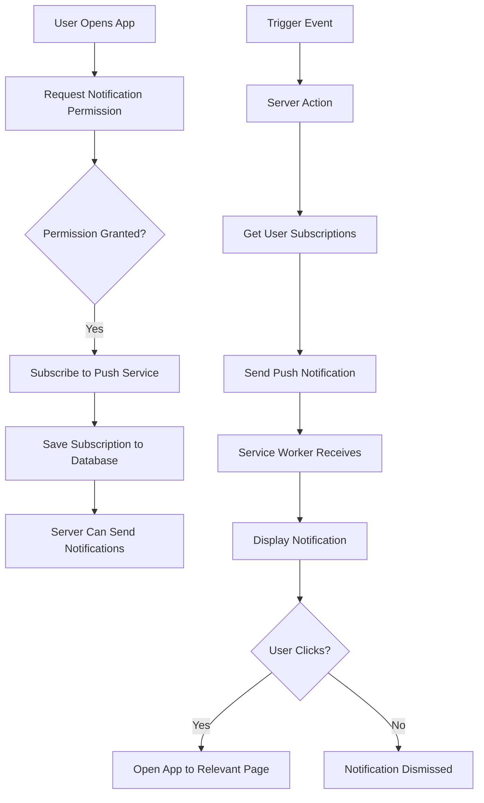

# 🔔 Push Notifications Implementation Guide - Web Push API

**Date:** February 4, 2026  
**Priority:** High  
**Estimated Time:** 5-6 hours  
**Status:** Ready to implement

---

## 🎯 Overview

This guide provides step-by-step instructions to implement **Web Push Notifications** for the MyCare PWA using the **Web Push API** and **VAPID** (Voluntary Application Server Identification).

### What We're Building

**Push Notification System for:**

1. **💊 Medication Reminders** - Notify caregivers when it's time to give medication
2. **📅 Shift Reminders** - Remind caregivers about upcoming shifts (1 hour before)
3. **🏥 Appointment Reminders** - Alert caregivers about medical appointments (24 hours before)
4. **⚠️ Urgent Shift Notes** - Instant notifications when urgent notes are added

### Why Web Push?

- ✅ **Works on PWA** - Native-like notifications on mobile and desktop
- ✅ **No third-party service needed** - Uses browser's native Push API
- ✅ **Works offline** - Service worker handles notifications even when app is closed
- ✅ **Cross-platform** - Works on Android, Chrome, Firefox, Edge
- ✅ **Free** - No cost for sending notifications
- ⚠️ **iOS limitation** - iOS Safari supports push notifications only for installed PWAs (iOS 16.4+)

---

## 📋 Architecture Overview



### Components

1. **Client-Side (Browser)**
   - Request notification permission
   - Subscribe to push service
   - Service worker to receive and display notifications

2. **Server-Side (Next.js)**
   - Generate VAPID keys
   - Store push subscriptions in database
   - Send push notifications via Web Push API

3. **Database**
   - New table: `push_subscriptions` to store user subscriptions

---

## 🗄️ Database Schema

### New Table: `push_subscriptions`

```sql
create table push_subscriptions (
  id uuid primary key default gen_random_uuid(),
  user_id uuid references auth.users(id) on delete cascade not null,
  endpoint text not null,
  p256dh text not null,
  auth text not null,
  user_agent text,
  created_at timestamptz default now() not null,
  updated_at timestamptz default now() not null,

  -- Ensure one subscription per endpoint
  unique(endpoint)
);

-- Index for faster lookups
create index push_subscriptions_user_id_idx on push_subscriptions(user_id);

-- RLS Policies
alter table push_subscriptions enable row level security;

-- Users can only manage their own subscriptions
create policy "Users can insert own subscriptions"
  on push_subscriptions for insert
  with check (auth.uid() = user_id);

create policy "Users can view own subscriptions"
  on push_subscriptions for select
  using (auth.uid() = user_id);

create policy "Users can delete own subscriptions"
  on push_subscriptions for delete
  using (auth.uid() = user_id);

-- Admins can view all subscriptions (for sending notifications)
create policy "Admins can view all subscriptions"
  on push_subscriptions for select
  using (
    exists (
      select 1 from profiles
      where profiles.id = auth.uid()
      and profiles.role = 'admin'
    )
  );
```

---

## 🔧 Implementation Steps

### Step 1: Generate VAPID Keys (5 minutes)

VAPID keys are used to identify your application to push services.

#### A. Install web-push package

```bash
cd apps/web
npm install web-push
npm install --save-dev @types/web-push
```

#### B. Generate VAPID keys

Create a script to generate keys:

**File:** `apps/web/scripts/generate-vapid-keys.js`

```javascript
const webpush = require("web-push");

const vapidKeys = webpush.generateVAPIDKeys();

console.log("\n=== VAPID Keys Generated ===\n");
console.log("Public Key:");
console.log(vapidKeys.publicKey);
console.log("\nPrivate Key:");
console.log(vapidKeys.privateKey);
console.log("\n=== Add these to your .env.local ===\n");
console.log(`NEXT_PUBLIC_VAPID_PUBLIC_KEY=${vapidKeys.publicKey}`);
console.log(`VAPID_PRIVATE_KEY=${vapidKeys.privateKey}`);
console.log("\n");
```

#### C. Run the script

```bash
node scripts/generate-vapid-keys.js
```

**Copy the output and save it!** You'll need these keys.

---

### Step 2: Environment Variables (5 minutes)

#### A. Update `.env.local`

**Location:** `apps/web/.env.local`

```env
# Supabase Configuration
NEXT_PUBLIC_SUPABASE_URL=your-supabase-url
NEXT_PUBLIC_SUPABASE_ANON_KEY=your-supabase-anon-key

# VAPID Keys for Web Push
NEXT_PUBLIC_VAPID_PUBLIC_KEY=your-public-key-here
VAPID_PRIVATE_KEY=your-private-key-here
VAPID_SUBJECT=mailto:your-email@example.com
```

**Replace:**

- `your-public-key-here` with the public key from Step 1
- `your-private-key-here` with the private key from Step 1
- `your-email@example.com` with your contact email

#### B. Update `.env.example`

```env
# Supabase Configuration
NEXT_PUBLIC_SUPABASE_URL=
NEXT_PUBLIC_SUPABASE_ANON_KEY=

# VAPID Keys for Web Push
NEXT_PUBLIC_VAPID_PUBLIC_KEY=
VAPID_PRIVATE_KEY=
VAPID_SUBJECT=mailto:your-email@example.com
```

#### C. Add to Vercel Environment Variables

1. Go to Vercel Dashboard → Your Project → Settings → Environment Variables
2. Add:
   - `NEXT_PUBLIC_VAPID_PUBLIC_KEY` (public key)
   - `VAPID_PRIVATE_KEY` (private key)
   - `VAPID_SUBJECT` (your email with `mailto:` prefix)

---

### Step 3: Database Migration (10 minutes)

#### Create Migration

**File:** `plans/migration-push-subscriptions.sql`

```sql
-- Create push_subscriptions table
create table if not exists push_subscriptions (
  id uuid primary key default gen_random_uuid(),
  user_id uuid references auth.users(id) on delete cascade not null,
  endpoint text not null,
  p256dh text not null,
  auth text not null,
  user_agent text,
  created_at timestamptz default now() not null,
  updated_at timestamptz default now() not null,

  -- Ensure one subscription per endpoint
  unique(endpoint)
);

-- Index for faster lookups
create index if not exists push_subscriptions_user_id_idx on push_subscriptions(user_id);

-- Enable RLS
alter table push_subscriptions enable row level security;

-- RLS Policies
create policy "Users can insert own subscriptions"
  on push_subscriptions for insert
  with check (auth.uid() = user_id);

create policy "Users can view own subscriptions"
  on push_subscriptions for select
  using (auth.uid() = user_id);

create policy "Users can delete own subscriptions"
  on push_subscriptions for delete
  using (auth.uid() = user_id);

-- Admins can view all subscriptions (for sending notifications)
create policy "Admins can view all subscriptions"
  on push_subscriptions for select
  using (
    exists (
      select 1 from profiles
      where profiles.id = auth.uid()
      and profiles.role = 'admin'
    )
  );

-- Grant permissions
grant all on push_subscriptions to authenticated;
```

#### Apply Migration

Use Supabase MCP or SQL Editor:

```bash
# Using Supabase MCP
supabase db push

# Or manually in Supabase SQL Editor
# Copy and paste the SQL above
```

---

### Step 4: Update Service Worker (30 minutes)

The service worker handles incoming push notifications and displays them.

#### Update `next.config.ts`

We need to add a custom service worker for push notifications.

**File:** `apps/web/next.config.ts`

```typescript
import type { NextConfig } from "next";
import withPWAInit from "next-pwa";

const withPWA = withPWAInit({
  dest: "public",
  register: true,
  skipWaiting: true,
  disable: process.env.NODE_ENV === "development",
  fallbacks: {
    document: "/offline",
  },
  // Add custom service worker
  sw: "sw.js",
  // Exclude certain paths from being cached
  runtimeCaching: [
    {
      urlPattern: /^https:\/\/.*\.supabase\.co\/.*/i,
      handler: "NetworkFirst",
      options: {
        cacheName: "supabase-api",
        expiration: {
          maxEntries: 32,
          maxAgeSeconds: 60 * 60, // 1 hour
        },
        networkTimeoutSeconds: 10,
      },
    },
    {
      urlPattern: /\.(?:png|jpg|jpeg|svg|gif|webp|ico)$/i,
      handler: "CacheFirst",
      options: {
        cacheName: "images",
        expiration: {
          maxEntries: 64,
          maxAgeSeconds: 30 * 24 * 60 * 60, // 30 days
        },
      },
    },
    {
      urlPattern: /\.(?:js|css)$/i,
      handler: "StaleWhileRevalidate",
      options: {
        cacheName: "static-resources",
        expiration: {
          maxEntries: 32,
          maxAgeSeconds: 24 * 60 * 60, // 24 hours
        },
      },
    },
  ],
});

const nextConfig: NextConfig = {
  turbopack: {},
};

export default withPWA(nextConfig);
```

#### Create Custom Service Worker

**File:** `apps/web/public/sw.js`

```javascript
// Import workbox for caching strategies
importScripts(
  "https://storage.googleapis.com/workbox-cdn/releases/6.5.4/workbox-sw.js",
);

// Initialize workbox
workbox.setConfig({ debug: false });

// Precache static assets
workbox.precaching.precacheAndRoute(self.__WB_MANIFEST || []);

// Cache strategies (same as next-pwa config)
workbox.routing.registerRoute(
  /^https:\/\/.*\.supabase\.co\/.*/i,
  new workbox.strategies.NetworkFirst({
    cacheName: "supabase-api",
    plugins: [
      new workbox.expiration.ExpirationPlugin({
        maxEntries: 32,
        maxAgeSeconds: 60 * 60, // 1 hour
      }),
    ],
  }),
);

workbox.routing.registerRoute(
  /\.(?:png|jpg|jpeg|svg|gif|webp|ico)$/i,
  new workbox.strategies.CacheFirst({
    cacheName: "images",
    plugins: [
      new workbox.expiration.ExpirationPlugin({
        maxEntries: 64,
        maxAgeSeconds: 30 * 24 * 60 * 60, // 30 days
      }),
    ],
  }),
);

workbox.routing.registerRoute(
  /\.(?:js|css)$/i,
  new workbox.strategies.StaleWhileRevalidate({
    cacheName: "static-resources",
    plugins: [
      new workbox.expiration.ExpirationPlugin({
        maxEntries: 32,
        maxAgeSeconds: 24 * 60 * 60, // 24 hours
      }),
    ],
  }),
);

// ===== PUSH NOTIFICATION HANDLING =====

// Listen for push events
self.addEventListener("push", function (event) {
  console.log("[Service Worker] Push received:", event);

  if (!event.data) {
    console.log("[Service Worker] Push event but no data");
    return;
  }

  let data;
  try {
    data = event.data.json();
  } catch (e) {
    console.error("[Service Worker] Error parsing push data:", e);
    data = {
      title: "MyCare",
      body: event.data.text(),
      icon: "/icons/icon-192x192.png",
      badge: "/icons/icon-72x72.png",
    };
  }

  const title = data.title || "MyCare";
  const options = {
    body: data.body || "Nueva notificación",
    icon: data.icon || "/icons/icon-192x192.png",
    badge: data.badge || "/icons/icon-72x72.png",
    tag: data.tag || "mycare-notification",
    data: {
      url: data.url || "/",
      ...data.data,
    },
    vibrate: [200, 100, 200],
    requireInteraction: data.requireInteraction || false,
  };

  event.waitUntil(self.registration.showNotification(title, options));
});

// Handle notification clicks
self.addEventListener("notificationclick", function (event) {
  console.log("[Service Worker] Notification clicked:", event);

  event.notification.close();

  const urlToOpen = event.notification.data?.url || "/";

  event.waitUntil(
    clients
      .matchAll({ type: "window", includeUncontrolled: true })
      .then(function (clientList) {
        // Check if there's already a window open
        for (let i = 0; i < clientList.length; i++) {
          const client = clientList[i];
          if (client.url === urlToOpen && "focus" in client) {
            return client.focus();
          }
        }
        // If no window is open, open a new one
        if (clients.openWindow) {
          return clients.openWindow(urlToOpen);
        }
      }),
  );
});

// Handle notification close
self.addEventListener("notificationclose", function (event) {
  console.log("[Service Worker] Notification closed:", event);
});

console.log("[Service Worker] Loaded with push notification support");
```

---

### Step 5: Create Push Notification Utilities (40 minutes)

#### A. Client-Side Utilities

**File:** `apps/web/src/lib/push/client.ts`

```typescript
"use client";

/**
 * Convert VAPID public key from base64 to Uint8Array
 */
function urlBase64ToUint8Array(base64String: string): Uint8Array {
  const padding = "=".repeat((4 - (base64String.length % 4)) % 4);
  const base64 = (base64String + padding).replace(/-/g, "+").replace(/_/g, "/");
  const rawData = window.atob(base64);
  const outputArray = new Uint8Array(rawData.length);
  for (let i = 0; i < rawData.length; ++i) {
    outputArray[i] = rawData.charCodeAt(i);
  }
  return outputArray;
}

/**
 * Check if push notifications are supported
 */
export function isPushSupported(): boolean {
  return (
    "serviceWorker" in navigator &&
    "PushManager" in window &&
    "Notification" in window
  );
}

/**
 * Get current notification permission status
 */
export function getNotificationPermission(): NotificationPermission {
  if (!("Notification" in window)) {
    return "denied";
  }
  return Notification.permission;
}

/**
 * Request notification permission from user
 */
export async function requestNotificationPermission(): Promise<NotificationPermission> {
  if (!("Notification" in window)) {
    console.error("Notifications not supported");
    return "denied";
  }

  const permission = await Notification.requestPermission();
  console.log("Notification permission:", permission);
  return permission;
}

/**
 * Subscribe to push notifications
 */
export async function subscribeToPush(): Promise<PushSubscription | null> {
  if (!isPushSupported()) {
    console.error("Push notifications not supported");
    return null;
  }

  try {
    // Get service worker registration
    const registration = await navigator.serviceWorker.ready;

    // Check if already subscribed
    let subscription = await registration.pushManager.getSubscription();

    if (subscription) {
      console.log("Already subscribed to push notifications");
      return subscription;
    }

    // Subscribe to push notifications
    const vapidPublicKey = process.env.NEXT_PUBLIC_VAPID_PUBLIC_KEY;
    if (!vapidPublicKey) {
      throw new Error("VAPID public key not configured");
    }

    const convertedVapidKey = urlBase64ToUint8Array(vapidPublicKey);

    subscription = await registration.pushManager.subscribe({
      userVisibleOnly: true,
      applicationServerKey: convertedVapidKey,
    });

    console.log("Subscribed to push notifications:", subscription);
    return subscription;
  } catch (error) {
    console.error("Error subscribing to push notifications:", error);
    return null;
  }
}

/**
 * Unsubscribe from push notifications
 */
export async function unsubscribeFromPush(): Promise<boolean> {
  if (!isPushSupported()) {
    return false;
  }

  try {
    const registration = await navigator.serviceWorker.ready;
    const subscription = await registration.pushManager.getSubscription();

    if (subscription) {
      const successful = await subscription.unsubscribe();
      console.log("Unsubscribed from push notifications:", successful);
      return successful;
    }

    return true;
  } catch (error) {
    console.error("Error unsubscribing from push notifications:", error);
    return false;
  }
}

/**
 * Get current push subscription
 */
export async function getPushSubscription(): Promise<PushSubscription | null> {
  if (!isPushSupported()) {
    return null;
  }

  try {
    const registration = await navigator.serviceWorker.ready;
    return await registration.pushManager.getSubscription();
  } catch (error) {
    console.error("Error getting push subscription:", error);
    return null;
  }
}
```

#### B. Server-Side Utilities

**File:** `apps/web/src/lib/push/server.ts`

```typescript
"use server";

import webpush from "web-push";
import { createClient } from "@/lib/supabase/server";

// Configure web-push with VAPID keys
webpush.setVapidDetails(
  process.env.VAPID_SUBJECT || "mailto:noreply@mycare.app",
  process.env.NEXT_PUBLIC_VAPID_PUBLIC_KEY || "",
  process.env.VAPID_PRIVATE_KEY || "",
);

export interface PushNotificationPayload {
  title: string;
  body: string;
  icon?: string;
  badge?: string;
  tag?: string;
  url?: string;
  requireInteraction?: boolean;
  data?: Record<string, any>;
}

/**
 * Send push notification to a specific user
 */
export async function sendPushNotification(
  userId: string,
  payload: PushNotificationPayload,
) {
  const supabase = await createClient();

  // Get all push subscriptions for this user
  const { data: subscriptions, error } = await supabase
    .from("push_subscriptions")
    .select("*")
    .eq("user_id", userId);

  if (error) {
    console.error("Error fetching push subscriptions:", error);
    return { success: false, error: error.message };
  }

  if (!subscriptions || subscriptions.length === 0) {
    console.log("No push subscriptions found for user:", userId);
    return { success: false, error: "No subscriptions found" };
  }

  // Send notification to all subscriptions
  const results = await Promise.allSettled(
    subscriptions.map(async (sub) => {
      try {
        const pushSubscription = {
          endpoint: sub.endpoint,
          keys: {
            p256dh: sub.p256dh,
            auth: sub.auth,
          },
        };

        await webpush.sendNotification(
          pushSubscription,
          JSON.stringify(payload),
        );

        return { success: true, endpoint: sub.endpoint };
      } catch (error: any) {
        console.error("Error sending push notification:", error);

        // If subscription is invalid (410 Gone), delete it
        if (error.statusCode === 410) {
          await supabase.from("push_subscriptions").delete().eq("id", sub.id);
          console.log("Deleted invalid subscription:", sub.id);
        }

        return { success: false, endpoint: sub.endpoint, error: error.message };
      }
    }),
  );

  const successful = results.filter((r) => r.status === "fulfilled").length;
  const failed = results.filter((r) => r.status === "rejected").length;

  return {
    success: successful > 0,
    sent: successful,
    failed,
    results,
  };
}

/**
 * Send push notification to multiple users
 */
export async function sendPushNotificationToUsers(
  userIds: string[],
  payload: PushNotificationPayload,
) {
  const results = await Promise.allSettled(
    userIds.map((userId) => sendPushNotification(userId, payload)),
  );

  return results;
}
```

---

### Step 6: Create Server Actions (40 minutes)

**File:** `apps/web/src/app/actions/push-notifications.ts`

```typescript
"use server";

import { createClient } from "@/lib/supabase/server";
import {
  sendPushNotification,
  sendPushNotificationToUsers,
} from "@/lib/push/server";

/**
 * Save push subscription to database
 */
export async function savePushSubscription(subscription: PushSubscription) {
  const supabase = await createClient();

  const {
    data: { user },
  } = await supabase.auth.getUser();

  if (!user) {
    return { success: false, error: "Not authenticated" };
  }

  const subscriptionData = subscription.toJSON();

  const { error } = await supabase.from("push_subscriptions").upsert(
    {
      user_id: user.id,
      endpoint: subscription.endpoint,
      p256dh: subscriptionData.keys?.p256dh || "",
      auth: subscriptionData.keys?.auth || "",
      user_agent: typeof navigator !== "undefined" ? navigator.userAgent : null,
    },
    {
      onConflict: "endpoint",
    },
  );

  if (error) {
    console.error("Error saving push subscription:", error);
    return { success: false, error: error.message };
  }

  return { success: true };
}

/**
 * Delete push subscription from database
 */
export async function deletePushSubscription(endpoint: string) {
  const supabase = await createClient();

  const { error } = await supabase
    .from("push_subscriptions")
    .delete()
    .eq("endpoint", endpoint);

  if (error) {
    console.error("Error deleting push subscription:", error);
    return { success: false, error: error.message };
  }

  return { success: true };
}

/**
 * Send medication reminder notification
 */
export async function sendMedicationReminderPush(medicationScheduleId: string) {
  const supabase = await createClient();

  // Get medication schedule with related data
  const { data: schedule, error } = await supabase
    .from("medication_schedules")
    .select(
      `
      *,
      medications (
        name,
        dosage,
        care_recipient_id,
        care_recipients (name)
      )
    `,
    )
    .eq("id", medicationScheduleId)
    .single();

  if (error || !schedule) {
    return { success: false, error: "Medication schedule not found" };
  }

  // Get caregivers assigned to this care recipient
  const { data: schedules } = await supabase
    .from("schedules")
    .select(
      `
      caregivers (
        profile_id
      )
    `,
    )
    .eq("care_recipient_id", schedule.medications.care_recipient_id);

  if (!schedules || schedules.length === 0) {
    return { success: false, error: "No caregivers found" };
  }

  // Get unique caregiver profile IDs
  const caregiverIds = [
    ...new Set(
      schedules
        .map((s) => s.caregivers?.profile_id)
        .filter((id): id is string => !!id),
    ),
  ];

  // Send push notification to all caregivers
  const results = await sendPushNotificationToUsers(caregiverIds, {
    title: "💊 Recordatorio de Medicamento",
    body: `${schedule.medications.name} - ${schedule.medications.dosage} para ${schedule.medications.care_recipients.name}`,
    icon: "/icons/icon-192x192.png",
    badge: "/icons/icon-72x72.png",
    tag: `medication-${medicationScheduleId}`,
    url: "/dashboard/medications",
    requireInteraction: true,
    data: {
      type: "medication",
      medicationScheduleId,
    },
  });

  return { success: true, results };
}

/**
 * Send shift reminder notification
 */
export async function sendShiftReminderPush(
  scheduleId: string,
  shiftDate: string,
) {
  const supabase = await createClient();

  // Get schedule with related data
  const { data: schedule, error } = await supabase
    .from("schedules")
    .select(
      `
      *,
      care_recipients (name),
      caregivers (profile_id)
    `,
    )
    .eq("id", scheduleId)
    .single();

  if (error || !schedule) {
    return { success: false, error: "Schedule not found" };
  }

  if (!schedule.caregivers?.profile_id) {
    return { success: false, error: "Caregiver not found" };
  }

  // Send push notification
  const result = await sendPushNotification(schedule.caregivers.profile_id, {
    title: "📅 Recordatorio de Turno",
    body: `Turno con ${schedule.care_recipients.name} - ${schedule.start_time} a ${schedule.end_time}`,
    icon: "/icons/icon-192x192.png",
    badge: "/icons/icon-72x72.png",
    tag: `shift-${scheduleId}-${shiftDate}`,
    url: "/dashboard/schedules",
    data: {
      type: "shift",
      scheduleId,
      shiftDate,
    },
  });

  return result;
}

/**
 * Send appointment reminder notification
 */
export async function sendAppointmentReminderPush(appointmentId: string) {
  const supabase = await createClient();

  // Get appointment with related data
  const { data: appointment, error } = await supabase
    .from("appointments")
    .select(
      `
      *,
      care_recipients (name),
      caregivers (profile_id)
    `,
    )
    .eq("id", appointmentId)
    .single();

  if (error || !appointment) {
    return { success: false, error: "Appointment not found" };
  }

  if (!appointment.caregivers?.profile_id) {
    return { success: false, error: "Caregiver not found" };
  }

  // Send push notification
  const result = await sendPushNotification(appointment.caregivers.profile_id, {
    title: "🏥 Recordatorio de Cita",
    body: `${appointment.type} - ${appointment.care_recipients.name} - ${appointment.appointment_time}`,
    icon: "/icons/icon-192x192.png",
    badge: "/icons/icon-72x72.png",
    tag: `appointment-${appointmentId}`,
    url: "/dashboard/appointments",
    requireInteraction: true,
    data: {
      type: "appointment",
      appointmentId,
    },
  });

  return result;
}

/**
 * Send urgent shift note notification
 */
export async function sendUrgentShiftNotePush(shiftNoteId: string) {
  const supabase = await createClient();

  // Get shift note with related data
  const { data: note, error } = await supabase
    .from("shift_notes")
    .select(
      `
      *,
      schedules (
        care_recipient_id,
        care_recipients (name)
      )
    `,
    )
    .eq("id", shiftNoteId)
    .single();

  if (error || !note) {
    return { success: false, error: "Shift note not found" };
  }

  // Get all caregivers for this care recipient (except the one who wrote the note)
  const { data: schedules } = await supabase
    .from("schedules")
    .select(
      `
      caregivers (profile_id)
    `,
    )
    .eq("care_recipient_id", note.schedules.care_recipient_id)
    .neq("caregiver_id", note.caregiver_id);

  if (!schedules || schedules.length === 0) {
    return { success: false, error: "No other caregivers found" };
  }

  // Get unique caregiver profile IDs
  const caregiverIds = [
    ...new Set(
      schedules
        .map((s) => s.caregivers?.profile_id)
        .filter((id): id is string => !!id),
    ),
  ];

  // Send push notification to all other caregivers
  const results = await sendPushNotificationToUsers(caregiverIds, {
    title: "⚠️ Nota Urgente",
    body: `Nueva nota urgente sobre ${note.schedules.care_recipients.name}`,
    icon: "/icons/icon-192x192.png",
    badge: "/icons/icon-72x72.png",
    tag: `urgent-note-${shiftNoteId}`,
    url: "/dashboard",
    requireInteraction: true,
    data: {
      type: "urgent-note",
      shiftNoteId,
    },
  });

  return { success: true, results };
}

/**
 * Test push notification
 */
export async function sendTestPushNotification() {
  const supabase = await createClient();

  const {
    data: { user },
  } = await supabase.auth.getUser();

  if (!user) {
    return { success: false, error: "Not authenticated" };
  }

  const result = await sendPushNotification(user.id, {
    title: "🔔 Notificación de Prueba",
    body: "Si ves esto, las notificaciones push están funcionando correctamente! ✅",
    icon: "/icons/icon-192x192.png",
    badge: "/icons/icon-72x72.png",
    tag: "test-notification",
    url: "/dashboard",
  });

  return result;
}
```

---

### Step 7: Create Notification Settings Component (30 minutes)

**File:** `apps/web/src/components/push-notification-settings.tsx`

```typescript
'use client'

import { useEffect, useState } from 'react'
import { Button } from '@/components/ui/button'
import { Card, CardContent, CardDescription, CardHeader, CardTitle } from '@/components/ui/card'
import { toast } from 'sonner'
import {
  isPushSupported,
  getNotificationPermission,
  requestNotificationPermission,
  subscribeToPush,
  unsubscribeFromPush,
  getPushSubscription,
} from '@/lib/push/client'
import {
  savePushSubscription,
  deletePushSubscription,
  sendTestPushNotification,
} from '@/app/actions/push-notifications'

export function PushNotificationSettings() {
  const [isSupported, setIsSupported] = useState(false)
  const [permission, setPermission] = useState<NotificationPermission>('default')
  const [isSubscribed, setIsSubscribed] = useState(false)
  const [isLoading, setIsLoading] = useState(false)

  useEffect(() => {
    // Check if push notifications are supported
    setIsSupported(isPushSupported())
    setPermission(getNotificationPermission())

    // Check if already subscribed
    checkSubscription()
  }, [])

  async function checkSubscription() {
    const subscription = await getPushSubscription()
    setIsSubscribed(!!subscription)
  }

  async function handleEnableNotifications() {
    setIsLoading(true)

    try {
      // Request permission
      const permission = await requestNotificationPermission()
      setPermission(permission)

      if (permission !== 'granted') {
        toast.error('Permiso de notificaciones denegado')
        return
      }

      // Subscribe to push notifications
      const subscription = await subscribeToPush()

      if (!subscription) {
        toast.error('Error al suscribirse a notificaciones')
        return
      }

      // Save subscription to database
      const result = await savePushSubscription(subscription)

      if (result.success) {
        setIsSubscribed(true)
        toast.success('Notificaciones activadas correctamente')
      } else {
        toast.error('Error al guardar suscripción')
      }
    } catch (error) {
      console.error('Error enabling notifications:', error)
      toast.error('Error al activar notificaciones')
    } finally {
      setIsLoading(false)
    }
  }

  async function handleDisableNotifications() {
    setIsLoading(true)

    try {
      const subscription = await getPushSubscription()

      if (subscription) {
        // Unsubscribe from push notifications
        await unsubscribeFromPush()

        // Delete subscription from database
        await deletePushSubscription(subscription.endpoint)
      }

      setIsSubscribed(false)
      toast.success('Notificaciones desactivadas')
    } catch (error) {
      console.error('Error disabling notifications:', error)
      toast.error('Error al desactivar notificaciones')
    } finally {
      setIsLoading(false)
    }
  }

  async function handleTestNotification() {
    setIsLoading(true)

    try {
      const result = await sendTestPushNotification()

      if (result.success) {
        toast.success('Notificación de prueba enviada')
      } else {
        toast.error('Error al enviar notificación de prueba')
      }
    } catch (error) {
      console.error('Error sending test notification:', error)
      toast.error('Error al enviar notificación')
    } finally {
      setIsLoading(false)
    }
  }

  if (!isSupported) {
    return (
      <Card>
        <CardHeader>
          <CardTitle>Notificaciones Push</CardTitle>
          <CardDescription>
            Las notificaciones push no están disponibles en este navegador
          </CardDescription>
        </CardHeader>
      </Card>
    )
  }

  return (
    <Card>
      <CardHeader>
        <CardTitle>Notificaciones Push</CardTitle>
        <CardDescription>
          Recibe notificaciones sobre medicamentos, turnos y citas
        </CardDescription>
      </CardHeader>
      <CardContent className="space-y-4">
        <div className="flex items-center justify-between">
          <div>
            <p className="font-medium">
              Estado: {isSubscribed ? '✅ Activadas' : '❌ Desactivadas'}
            </p>
            <p className="text-sm text-muted-foreground">
              Permiso: {permission === 'granted' ? 'Concedido' : permission === 'denied' ? 'Denegado' : 'No solicitado'}
            </p>
          </div>

          {!isSubscribed ? (
            <Button
              onClick={handleEnableNotifications}
              disabled={isLoading || permission === 'denied'}
            >
              {isLoading ? 'Activando...' : 'Activar Notificaciones'}
            </Button>
          ) : (
            <Button
              variant="outline"
              onClick={handleDisableNotifications}
              disabled={isLoading}
            >
              {isLoading ? 'Desactivando...' : 'Desactivar'}
            </Button>
          )}
        </div>

        {isSubscribed && (
          <Button
            variant="secondary"
            onClick={handleTestNotification}
            disabled={isLoading}
            className="w-full"
          >
            Enviar Notificación de Prueba
          </Button>
        )}

        {permission === 'denied' && (
          <p className="text-sm text-destructive">
            Has denegado el permiso de notificaciones. Para activarlas, debes cambiar la configuración en tu navegador.
          </p>
        )}
      </CardContent>
    </Card>
  )
}
```

---

### Step 8: Add to Dashboard (10 minutes)

Add the notification settings component to the dashboard.

**File:** `apps/web/src/app/dashboard/page.tsx`

```typescript
import { PushNotificationSettings } from '@/components/push-notification-settings'

export default function DashboardPage() {
  return (
    <div className="space-y-6">
      <h1 className="text-3xl font-bold">Dashboard</h1>

      {/* Add notification settings */}
      <PushNotificationSettings />

      {/* Rest of dashboard content */}
    </div>
  )
}
```

---

## 🧪 Testing Guide

### Step 1: Test Permission Request

1. Open the app in a browser
2. Go to Dashboard
3. Click "Activar Notificaciones"
4. Browser should show permission prompt
5. Click "Allow"
6. Should see "✅ Activadas" status

### Step 2: Test Subscription

1. Open browser DevTools → Application → Service Workers
2. Verify service worker is registered
3. Go to Application → Push Messaging
4. Should see subscription details

### Step 3: Test Notification

1. Click "Enviar Notificación de Prueba"
2. Should receive a notification
3. Click the notification
4. Should open the app

### Step 4: Test on Mobile

1. Install PWA on Android
2. Enable notifications
3. Close the app
4. Send test notification
5. Should receive notification even when app is closed

---

## 📊 Implementation Checklist

### Setup

- [ ] Install web-push package
- [ ] Generate VAPID keys
- [ ] Add environment variables to `.env.local`
- [ ] Add environment variables to Vercel
- [ ] Apply database migration

### Code Implementation

- [ ] Create custom service worker (`public/sw.js`)
- [ ] Create client utilities (`lib/push/client.ts`)
- [ ] Create server utilities (`lib/push/server.ts`)
- [ ] Create server actions (`app/actions/push-notifications.ts`)
- [ ] Create settings component (`components/push-notification-settings.tsx`)
- [ ] Add to dashboard

### Testing

- [ ] Test permission request
- [ ] Test subscription
- [ ] Test notification display
- [ ] Test notification click
- [ ] Test on mobile device
- [ ] Test with app closed
- [ ] Test unsubscribe

### Deployment

- [ ] Commit changes
- [ ] Push to GitHub
- [ ] Create PR
- [ ] Merge to main
- [ ] Verify environment variables in Vercel
- [ ] Test in production

---

## 🚀 Next Steps (Optional)

### Add Automatic Scheduling

Use Vercel Cron Jobs to automatically send notifications:

**File:** `apps/web/vercel.json`

```json
{
  "crons": [
    {
      "path": "/api/cron/medication-reminders",
      "schedule": "*/15 * * * *"
    },
    {
      "path": "/api/cron/shift-reminders",
      "schedule": "0 * * * *"
    },
    {
      "path": "/api/cron/appointment-reminders",
      "schedule": "0 9 * * *"
    }
  ]
}
```

Create API routes for each cron job to check and send notifications.

---

## 📝 Success Criteria

- [ ] Users can enable/disable push notifications
- [ ] Notifications display correctly
- [ ] Clicking notification opens relevant page
- [ ] Works on mobile (Android)
- [ ] Works when app is closed
- [ ] Invalid subscriptions are cleaned up
- [ ] No errors in console

---

## 🎯 Summary

**What You'll Have:**

- ✅ Web Push Notifications for PWA
- ✅ 4 types of notifications (medication, shift, appointment, urgent notes)
- ✅ User-controlled notification settings
- ✅ Works offline via service worker
- ✅ Automatic cleanup of invalid subscriptions
- ✅ Test notification function

**Estimated Time:** 5-6 hours total

**Ready to implement?** Follow the steps above in order, and you'll have a fully functional push notification system!
